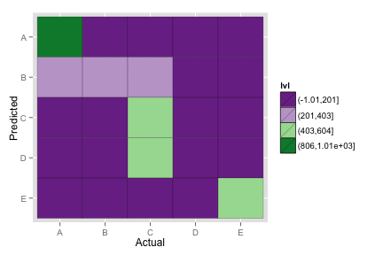
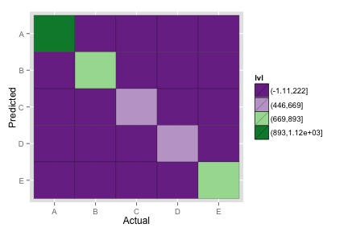

Qualitative Activity Recognition - Reproducing Test Results
========================================================

Background
----------

This project is based on the study of [Qualitative Activity Recognition of Weight Lifting Exercises](http://groupware.les.inf.puc-rio.br/public/papers/2013.Velloso.QAR-WLE.pdf). The basic idea of this particular study was to extend the quantitative approach of Human Activity Recognition (HAR) to a qualitive one. Many of the current approaches are 
limited to distinguish the human activities from each other such as sleeping, walking and sitting. 
However, the case can be that it is not just the quantity that is of interest but also the quality of the exercise.
The authors of the study do show this in the example of weight training (using the dumbell raises as an example), where:

1. the quantity of raises not necessarily represent the amount of exercise done
2. wrong application can lead to injuries

The authors suggested a set to measure the movements with a specific sensor setup ([seeStudy](http://groupware.les.inf.puc-rio.br/public/papers/2013.Velloso.QAR-WLE.pdf)). And then instructed the test subject to simulate "good" and "bad" dumbell raises.

Goal of this Draft
------------------
In this draft we work with the sensor data and use them to train and validate two models based on:

1. Random Forests
2. Recursive Partitioning and Regression Trees

For this exercise we will be using the "caret" package available for r and leave all the parameter at default.


```
## Loading required package: lattice
## Loading required package: ggplot2
## Loading required package: foreach
## Loading required package: iterators
## Loading required package: parallel
```


Data Preparation
----------------

The inital data cleansing occurs when loading the data:

1. Remove all columns that contain mostly NAs
2. remove columns with non-numeric variables 


```r

traindata_pre <- read.csv("pml-training.csv", na.strings = c("NA", ""))
traindata_pre <- traindata_pre[, colSums(is.na(traindata_pre)) < 0.95 * nrow(traindata_pre)]
rem_col <- c("user_name", "cvtd_timestamp", "raw_timestamp_part_1", "raw_timestamp_part_2", 
    "new_window", "X")
traindata_pre <- traindata_pre[, !(names(traindata_pre) %in% rem_col)]
```


We will divide the training data into 5 folds. The intent is to use 2 folds for each model, Random Forests and Recursive Partitioning and Regression Trees. One fold of each will be used for training purpose the second set for validation.


```r
set.seed(32323)
folds <- createFolds(y = traindata_pre$classe, k = 5, list = T, returnTrain = F)
```


Model Comparison
----------------
The first model we choose is Recursive Partitioning and Regression Trees. We use as described part of the training data for training purposes and another part for validation. Note that we kept all parameter for the train function default.

```r
modFitrpart <- train(traindata_pre[folds[[3]], ]$classe ~ ., data = traindata_pre[folds[[3]], 
    ], method = "rpart")
val_rpart <- predict(modFitrpart, traindata_pre[folds[[4]], ])
c_part <- confusionMatrix(traindata_pre[folds[[4]], ]$classe, val_rpart)
```

Overall Accuracy Estimate for the RPART test run:

```
## Accuracy 
##   0.5767
```


Table of the Confusion Matrix for a Recursive Partitioning and Regression Trees. Note that the RPART model is particularuly flawed, when it comes to distinguishing the cases B and C. 

```
##           Reference
## Prediction    A    B    C    D    E
##          A 1007    9   87    0   13
##          B  216  231  313    0    0
##          C  123   15  546    0    0
##          D   96  103  418    0   26
##          E   21   39  182    0  479
```

Plotting the heat map for the Recursive Partitioning and Regression Trees model. This plot again shows issues with cases B and C. 

```r
c_data <- as.data.frame(c_part$table)
c_data$Prediction <- with(c_data, factor(Prediction, levels = rev(levels(Prediction))))
c_data$lvl <- cut(c_data$Freq, breaks = 5)
ggplot() + geom_tile(aes(x = Reference, y = Prediction, fill = lvl), data = c_data, 
    color = "black", size = 0.1, cellnote = c_data$Freq) + labs(x = "Actual", 
    y = "Predicted") + scale_fill_brewer(palette = "PRGn")
```

 

As second model we choose is Random Forests. Again we use part of the training data for training purposes and another part for validation. Note that we kept all parameter for the train function default except for the fact that we enable parallel processing.

```r
mControl <- trainControl(allowParallel = TRUE)
modFitrf <- train(traindata_pre[folds[[1]], ]$classe ~ ., data = traindata_pre[folds[[1]], 
    ], method = "rf", trControl = mControl)
val_rf <- predict(modFitrf, traindata_pre[folds[[2]], ])
c_rf <- confusionMatrix(traindata_pre[folds[[2]], ]$classe, val_rf)
```

Overall Accuracy Estimate for the Ramdom Forest test run show a much higher accuracy, than was experienced with RPART:

```
## Accuracy 
##   0.9839
```


Table of the Confusion Matrix for a Random Forest test run. A we would expect from high overall accuracy estimate this model is better equipped to distinguish between the cases B and C

```
##           Reference
## Prediction    A    B    C    D    E
##          A 1115    0    0    0    1
##          B   13  733   13    0    0
##          C    0   16  667    2    0
##          D    0    1    7  635    1
##          E    0    2    3    4  712
```

Plotting the heat map for the Random Forests model.
 


Testing Data and Submission
---------------------------
As part of the exercise we were given a set of test date

```r
# prepare the test data
testdata_pre <- read.csv("pml-testing.csv", na.strings = c("NA", ""))
coln <- names(traindata_pre)
testdata_pre <- testdata_pre[, names(testdata_pre) %in% coln]
```

Row one shows the predicted values for a Recursive Partitioning and Regression Trees and row for the Random Forest Model

```r
predict(modFitrpart, testdata_pre)
```

```
##  [1] A A C A A C C C A A C C C A C C A A A C
## Levels: A B C D E
```

```r
predict(modFitrf, testdata_pre)
```

```
##  [1] B A B A A E D B A A B C B A E E A B B B
## Levels: A B C D E
```


